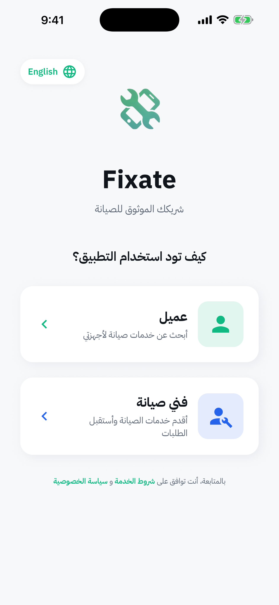
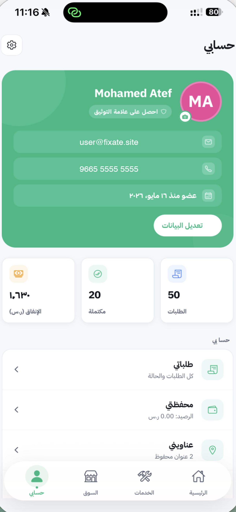

# Fixate 🔧

**Mobile device repair platform — connect Saudi customers with certified technicians.**

> Looking for the pitch / market story? See [docs/business/INVESTOR_SUMMARY.md](docs/business/INVESTOR_SUMMARY.md).
> Need to set things up? See [docs/setup/](docs/setup/).

[](https://github.com/muhammedatef98/fixate-mobile/actions/workflows/ci.yml)
[](https://expo.dev)
[](LICENSE)

---

## Screenshots

| Login | Home | Services |
| :---: | :---: | :---: |
|  |  |  |

| Marketplace | Order tracking | Profile |
| :---: | :---: | :---: |
|  |  |  |

## Features

- 📱 **Customer:** request a repair in under 60s, track the technician live, pay in-app, rate & review
- 🛠️ **Technician:** accept jobs nearby, broadcast live location, manage status pipeline, view earnings
- 🆔 **Saudi-specific verification:** National ID / Iqama checksum, IBAN validation, document upload
- 💬 **Realtime chat** between customer and technician, plus phone-call shortcut
- 🔔 **Email OTP login** (no SMS provider needed) and password reset, via custom Resend Edge Function
- 🌗 **RTL + dark mode** out of the box, Cairo font for Arabic
- 🛡️ **RLS-everywhere** Postgres schema with admin verification flow

## Tech stack

- React Native 19 + Expo SDK 54 + Expo Router
- Supabase (Postgres, Auth, Storage, Realtime, Edge Functions)
- TypeScript, Jest, GitHub Actions
- Stripe-ready payments (server-side PaymentIntent via Edge Function)
- React Native Maps for live tracking

## Getting started

```bash
git clone https://github.com/muhammedatef98/fixate-mobile.git
cd fixate-mobile
pnpm install
cp .env.example .env   # fill in EXPO_PUBLIC_SUPABASE_URL / _ANON_KEY
pnpm start             # press i / a / scan the QR with Expo Go
```

For first-time Supabase setup, OAuth, Firebase push, and production checklist, walk through
[docs/setup/QUICK_START.md](docs/setup/QUICK_START.md).

## Project structure

```
app/                  Expo Router screens (customer, technician, shared)
components/           Reusable UI (BottomNav, RTLIcon, ErrorState, ...)
contexts/             AppContext, AuthContext, OrdersContext, RequestContext
services/             API wrappers (auth, orders, payments, OTP, locations, ...)
lib/                  Supabase client + legacy helpers
utils/                logger, validation, haptics, errorMessages, RTL helpers
types/                Single-source-of-truth domain types (Order, OrderStatus)
constants/            theme, translations, issue categories
supabase/migrations/  Database migrations (see folder README)
supabase-functions/   Edge Functions (send-otp, verify-otp, create-payment, notify-technicians)
docs/                 Setup guides, business material, internal notes
__tests__/            Jest unit tests
```

## Useful scripts

| Script | What it does |
| ------ | ------------ |
| `pnpm start` | Start Expo dev server |
| `pnpm test` | Run Jest unit tests |
| `pnpm test:ci` | Run tests in CI mode (no watch, force exit) |
| `pnpm typecheck` | `tsc --noEmit` |
| `pnpm lint` | ESLint |
| `pnpm format` | Prettier write |

## Contributing

PRs welcome. See [CONTRIBUTING.md](CONTRIBUTING.md) for the workflow and
[SECURITY.md](SECURITY.md) for how to report vulnerabilities.

## License

MIT — see [LICENSE](LICENSE).

## Contact

- 📧 fixate01@gmail.com
- 📱 +966 54 894 0042
- 🌐 [github.com/muhammedatef98/fixate-mobile](https://github.com/muhammedatef98/fixate-mobile)

---

## 🇸🇦 ملخّص بالعربية

**Fixate** — منصّة جوّال تربط عملاء السعودية بفنيين معتمدين لإصلاح الأجهزة الإلكترونية:
- العميل يطلب صيانة خلال أقل من 60 ثانية، يتتبّع الفني على الخريطة، يدفع داخل التطبيق، ويقيّم الخدمة
- الفني يستلم الطلبات القريبة، يبثّ موقعه، ويدير دورة حياة الإصلاح من القبول للتسليم
- التحقّق من الفني وفق النظام السعودي (هوية وطنية / إقامة + IBAN + مستندات)
- تسجيل دخول بالإيميل عبر OTP مجاني (بدون مزوّد SMS)، Edge Function مخصّص عبر Resend
- دعم كامل لـ RTL والوضع الليلي، خط Cairo

**ابدأ:** انسخ المستودع، شغّل `pnpm install`، انسخ `.env.example` إلى `.env` واملأه، ثم `pnpm start`.

**الأدلة الكاملة:** [docs/setup/](docs/setup/) — Supabase, OAuth, Firebase, Production Checklist.
**الفرصة الاستثمارية:** [docs/business/INVESTOR_SUMMARY.md](docs/business/INVESTOR_SUMMARY.md).
