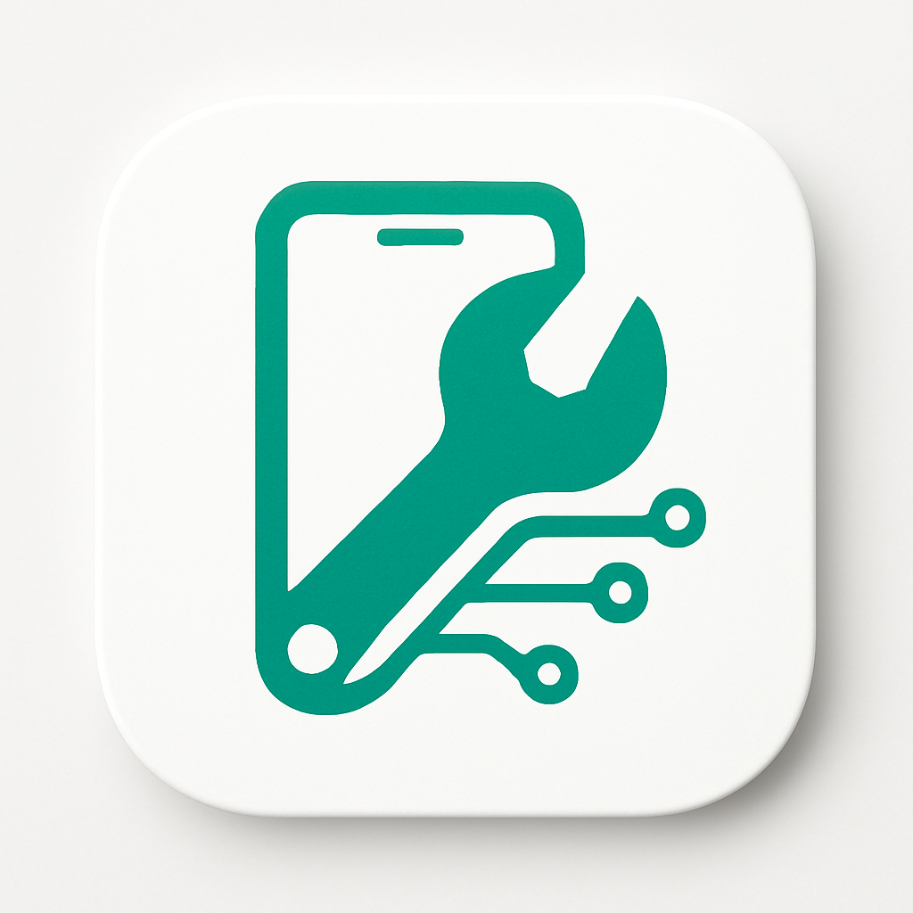

# Fixatee - Your Trusted Device Repair Partner 🔧
# Fixatee - شريكك الموثوق في إصلاح الأجهزة 🔧
<!-- CI secrets rotated: 2026-04-28 -->

<div align="center">
  
  
  ### Professional Device Repair Services at Your Fingertips
  ### خدمات إصلاح الأجهزة الاحترافية في متناول يدك
  
  *Connecting customers with certified technicians for fast, reliable repairs*  
  *نربط العملاء بالفنيين المعتمدين لإصلاحات سريعة وموثوقة*
  
  [](https://expo.dev)
  []()
  []()
  
  [English](#english) | [العربية](#arabic)
</div>

---

<a name="english"></a>
# 🇬🇧 English Version

## 🌟 About Fixate

**Fixate** is revolutionizing the device repair industry in Saudi Arabia by creating a seamless bridge between customers and certified repair technicians. We understand the frustration of dealing with broken devices, and we're here to make the repair process as smooth and transparent as possible.

### The Problem We Solve

- ❌ Long waiting times at traditional repair shops
- ❌ Lack of price transparency
- ❌ Difficulty finding trustworthy technicians
- ❌ No convenient way to request on-site repairs

### Our Solution

✅ **Instant Booking** - Request repairs in under 60 seconds  
✅ **Transparent Pricing** - Know the cost before you commit  
✅ **Certified Technicians** - Only verified professionals  
✅ **Location-Based Matching** - Find technicians near you  
✅ **Real-Time Tracking** - Monitor your repair request status  

---

## 📱 Key Features

### For Customers

| Feature | Description |
|---------|-------------|
| 🔍 **Smart Device Selection** | Choose from Apple, Samsung, Huawei, Xiaomi and more |
| 💰 **Price Calculator** | Get instant repair cost estimates |
| 📍 **Location Services** | Interactive map for precise location sharing |
| 📝 **Detailed Descriptions** | Explain your device issue in detail |
| ⚡ **Quick Requests** | Submit repair requests without lengthy registration |
| 📊 **Request Tracking** | Monitor the status of your repairs |

### For Technicians

| Feature | Description |
|---------|-------------|
| 📋 **Job Dashboard** | View all incoming repair requests |
| 🗺️ **Location-Based Jobs** | See requests in your service area |
| 💼 **Professional Profile** | Showcase your expertise and ratings |
| 🔔 **Real-Time Notifications** | Never miss a new opportunity |
| 📈 **Performance Analytics** | Track your completed jobs and earnings |

---

## 🎯 Service Options

We offer two flexible service modes to meet different repair needs:

### 🔧 Mobile Technician
**On-Site Repair Service**
- Professional technician comes to your location (home, office, anywhere)
- Repairs performed on-site using fully-equipped mobile van
- **Best for**: Simple to moderate repairs (screen, battery, charging port, audio)
- **Timeline**: Same day or scheduled appointment
- **Benefits**: 
  - ⚡ Fast service
  - 📍 Real-time technician tracking
  - 🏠 Convenience of home service
  - 👁️ Watch the repair process

### 🚚 Pickup & Delivery
**Workshop Repair Service**
- Courier picks up your device from your location
- Device delivered to specialized partner workshop
- Professional repair with advanced equipment
- Courier returns device after completion
- **Best for**: Complex repairs (motherboard, processor, water damage, precision work)
- **Timeline**: 1-3 days depending on repair complexity
- **Benefits**:
  - 🔧 Professional workshop equipment
  - 🛡️ Extended warranty
  - 💰 Competitive pricing
  - 🏭 Access to specialized parts

---

## 🚀 Market Opportunity

### Target Market
- **Primary**: Saudi Arabia smartphone and laptop users
- **Secondary**: Expanding to GCC countries
- **Market Size**: 35M+ smartphone users in Saudi Arabia alone

### Geographic Launch Strategy

#### 🎯 Phase 1: Dammam (Q1 2025)
**Why Dammam?**
- ✅ Perfect mid-size test market
- ✅ Less competition than Riyadh and Jeddah
- ✅ Lower customer acquisition costs
- ✅ Tech-savvy community
- ✅ Strategic proximity to Bahrain and Kuwait for future expansion

**Targets**: 200 technicians, 2,000 customers, 3,000 orders in 3 months

#### Phase 2: Khobar & Dhahran (Q2 2025)
- Natural expansion in Eastern Province
- Target Aramco employees and major companies

#### Phase 3: Riyadh & Jeddah (Q3 2025)
- Enter major markets after proven model

#### Phase 4: All Saudi Cities (Q4 2025)
#### Phase 5: GCC Countries (2026)

---

## 💡 Technology Stack

- **Frontend**: React Native 19 with Expo
- **Navigation**: Expo Router
- **Maps**: Google Maps API
- **State Management**: React Context API
- **Backend**: Supabase (PostgreSQL, Authentication, Storage)

---

## 🚀 Getting Started

### Installation

```bash
git clone https://github.com/muhammedatef98/fixatee-mobile.git
cd fixatee-mobile
npm install
npx expo start
```

### Run on Device
- Press `i` for iOS simulator
- Press `a` for Android emulator
- Scan QR code with Expo Go app on physical device

---

## 📞 Contact & Investment Opportunities

We're actively seeking strategic partners and investors to scale Fixatee across the region.

📧 **Email**: fixate01@gmail.com  
📱 **Phone**: +966 54 894 0042  
🌐 **GitHub**: https://github.com/muhammedatef98/fixatee-mobile

**For Business Inquiries**: Available for pitch deck presentations and product demos.

---

## 📄 License

This project is licensed under the MIT License - see the [LICENSE](LICENSE) file for details.

---

<div align="center">
  <p>Made with ❤️ by the Fixatee Team</p>
  <p>© 2024 Fixatee. All rights reserved.</p>
</div>

---
---

<a name="arabic"></a>
# 🇸🇦 النسخة العربية

## 🌟 عن Fixatee

**Fixatee** يُحدث ثورة في صناعة إصلاح الأجهزة في المملكة العربية السعودية من خلال إنشاء جسر سلس بين العملاء والفنيين المعتمدين. نحن نفهم الإحباط الناتج عن التعامل مع الأجهزة المعطلة، ونحن هنا لجعل عملية الإصلاح سلسة وشفافة قدر الإمكان.

### المشكلة التي نحلها

- ❌ أوقات انتظار طويلة في محلات الإصلاح التقليدية
- ❌ عدم وضوح الأسعار
- ❌ صعوبة إيجاد فنيين موثوقين
- ❌ عدم وجود طريقة مريحة لطلب الإصلاح في الموقع

### الحل الذي نقدمه

✅ **حجز فوري** - اطلب الإصلاح في أقل من 60 ثانية  
✅ **أسعار شفافة** - اعرف التكلفة قبل الالتزام  
✅ **فنيون معتمدون** - محترفون موثقون فقط  
✅ **مطابقة حسب الموقع** - ابحث عن فنيين بالقرب منك  
✅ **تتبع فوري** - راقب حالة طلب الإصلاح  

---

## 📱 الميزات الرئيسية

### للعملاء

| الميزة | الوصف |
|---------|-------------|
| 🔍 **اختيار ذكي للأجهزة** | اختر من Apple وSamsung وHuawei وXiaomi والمزيد |
| 💰 **حاسبة الأسعار** | احصل على تقديرات فورية لتكلفة الإصلاح |
| 📍 **خدمات الموقع** | خريطة تفاعلية لمشاركة الموقع الدقيق |
| 📝 **أوصاف تفصيلية** | اشرح مشكلة جهازك بالتفصيل |
| ⚡ **طلبات سريعة** | قدم طلبات الإصلاح دون تسجيل طويل |
| 📊 **تتبع الطلبات** | راقب حالة إصلاحاتك |

### للفنيين

| الميزة | الوصف |
|---------|-------------|
| 📋 **لوحة الوظائف** | عرض جميع طلبات الإصلاح الواردة |
| 🗺️ **وظائف حسب الموقع** | شاهد الطلبات في منطقة خدمتك |
| 💼 **ملف احترافي** | اعرض خبرتك وتقييماتك |
| 🔔 **إشعارات فورية** | لا تفوت أي فرصة جديدة |
| 📈 **تحليلات الأداء** | تتبع وظائفك المكتملة وأرباحك |

---

## 🎯 خيارات الخدمة

نوفر خيارين مرنين لتلبية احتياجات الإصلاح المختلفة:

### 🔧 فني متنقل
**خدمة الإصلاح في المكان**
- يأتي الفني المحترف إلى موقعك (منزل، مكتب، أي مكان)
- يتم الإصلاح في المكان باستخدام عربة مجهزة بالكامل
- **مثالي لـ**: الإصلاحات البسيطة والمتوسطة (شاشة، بطارية، منفذ شحن، صوت)
- **الوقت**: نفس اليوم أو موعد محدد
- **المميزات**:
  - ⚡ خدمة سريعة
  - 📍 تتبع مباشر للفني
  - 🏠 راحة الخدمة المنزلية
  - 👁️ مشاهدة عملية الإصلاح

### 🚚 استلام وتوصيل
**خدمة الإصلاح في الورشة**
- مندوب يستلم جهازك من موقعك
- يتم توصيل الجهاز إلى ورشة متخصصة متعاقدة
- إصلاح احترافي بمعدات متقدمة
- المندوب يرجع الجهاز بعد الإنتهاء
- **مثالي لـ**: الإصلاحات المعقدة (لوحة أم، معالج، ضرر الماء، أعمال دقيقة)
- **الوقت**: 1-3 أيام حسب تعقيد الإصلاح
- **المميزات**:
  - 🔧 معدات ورشة احترافية
  - 🛡️ ضمان ممتد
  - 💰 أسعار تنافسية
  - 🏭 الوصول لقطع غيار متخصصة

---

## 🚀 فرصة السوق

### السوق المستهدف
- **الأساسي**: مستخدمو الهواتف الذكية واللابتوب في المملكة العربية السعودية
- **الثانوي**: التوسع في دول مجلس التعاون الخليجي
- **حجم السوق**: أكثر من 35 مليون مستخدم هاتف ذكي في السعودية وحدها

### استراتيجية الإطلاق الجغرافي

#### 🎯 المرحلة الأولى: الدمام (الربع الأول 2025)
**لماذا الدمام؟**
- ✅ سوق متوسط الحجم مثالي للاختبار والتعلم
- ✅ منافسة أقل من الرياض وجدة
- ✅ تكلفة اكتساب عملاء أقل
- ✅ مجتمع تقني نشط ومتقبل للتكنولوجيا
- ✅ قرب استراتيجي من البحرين والكويت للتوسع المستقبلي

**الأهداف**: 200 فني، 2,000 عميل، 3,000 طلب في 3 أشهر

#### المرحلة الثانية: الخبر والظهران (الربع الثاني 2025)
- توسع طبيعي في المنطقة الشرقية
- استهداف موظفي أرامكو والشركات الكبرى

#### المرحلة الثالثة: الرياض وجدة (الربع الثالث 2025)
- دخول الأسواق الكبرى بعد إثبات نموذج العمل

#### المرحلة الرابعة: باقي المدن السعودية (الربع الرابع 2025)
#### المرحلة الخامسة: دول الخليج (2026)

---

## 💡 التقنيات المستخدمة

- **الواجهة الأمامية**: React Native 19 مع Expo
- **التنقل**: Expo Router
- **الخرائط**: Google Maps API
- **إدارة الحالة**: React Context API
- **قاعدة البيانات**: Supabase (PostgreSQL)

---

## 🚀 البدء

### التثبيت

```bash
git clone https://github.com/muhammedatef98/fixatee-mobile.git
cd fixatee-mobile
npm install
npx expo start
```

### التشغيل على الجهاز
- اضغط `i` لمحاكي iOS
- اضغط `a` لمحاكي Android
- امسح رمز QR باستخدام تطبيق Expo Go على الجهاز الفعلي

---

## 📞 التواصل وفرص الاستثمار

نبحث بنشاط عن شركاء استراتيجيين ومستثمرين لتوسيع نطاق Fixatee في جميع أنحاء المنطقة.

📧 **البريد الإلكتروني**: fixate01@gmail.com  
📱 **الهاتف**: 0548940042  
🌐 **GitHub**: https://github.com/muhammedatef98/fixatee-mobile

**للاستفسارات التجارية**: متاح للعروض التقديمية والعروض التوضيحية للمنتج.

---

## 📄 الترخيص

هذا المشروع مرخص بموجب ترخيص MIT - راجع ملف [LICENSE](LICENSE) للحصول على التفاصيل.

---

<div align="center">
  <p>صُنع بـ ❤️ من فريق Fixatee</p>
  <p>© 2024 Fixatee. جميع الحقوق محفوظة.</p>
</div>
